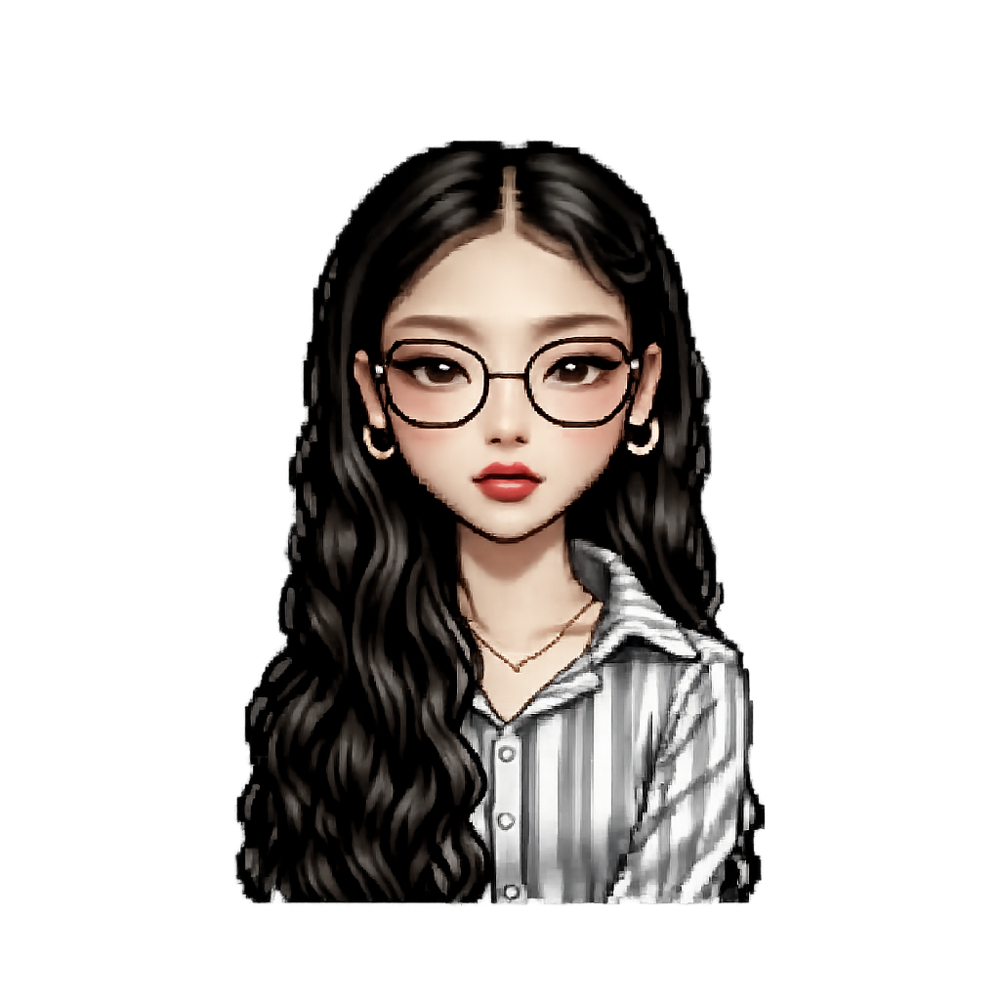

  

  <h1>Hi there, I'm Khorn Molika </h1>
  
  

  

    <i>Computer Science student with hands-on experience in web and mobile development, including Django-based analytics systems, PHP content management systems, and database-driven applications. Strong in backend development, SQL, and secure CRUD operations, with a growing interest in FinTech and financial technology solutions.</i>
  

---

  

---

##  Tech Stack & Skills

  
  
  
  
  
  
  
  
  
  

 

##  GitHub Activity & Stats

  

 

  
  

 

##  Education

> **Bachelor of Computer Science and Engineering**
> *ACLEDA University of Business* | `2024 - 2027`
> 
> **Associate Degree of Cyber Security**
> *TUX Global Institute* | `2025 - 2027`

 

##  Work Experience

> **FinTech Development Office** | *Software Development Intern*
> Developed a reusable assessment microservice supporting e-learning, surveys, technology risk assessments, and real-time quizzes.
>
> **ABU ROBOCON** | *Volunteer Field Team*
> Managed robot practice fields and coordinated schedules for competition rounds, ensuring a smooth and fair event for all participants. `2023`

 

##  Projects

| Project | Description | Details |
| :--- | :--- | :---: |
| **Aroma Shop** | E-commerce Django web app to manage products and shopping carts. | [github/Aroma](https://github.com/KhornMolika/Aroma) |
| **Teaching Record** | Django web app streamlining record management for educational institutions. | [github/Teaching-Record](https://github.com/KhornMolika/Teaching-Record) |
| **CMS** | Lightweight PHP & MySQL Content Management System with a Tailwind CSS dashboard. | [github/CMS](https://github.com/KhornMolika/CMS) |

 

##  Achievements

- **Graduated with grade A** — Diploma in Electronic (2023)
- **Top project team at ISTAD** — 100% IT FOUNDATION Scholarship (2024)

 

---

##  Get in Touch

  
  
  

